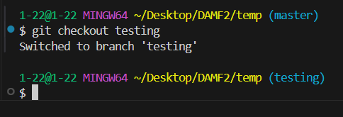

## GIT의 브랜치
    - 나눠서 안정성 있게 개발을 하고 하나로 합치는 과정

## GIT 브랜치 설정
    - git branch {text} : 브랜치 생성
    - git branch : 생성 된 브랜치 확인
    - git checkout / git swithch : 브랜치를 이동 하는 명령어

    - git merge {브랜치이름} : 브랜치를 합치는 명령어

## 합치는 과정을 마무리 하는 커밋
- git add . 
- git commit -m {}

## 브랜치 삭제
- git branch -d {브랜치이름}