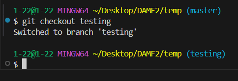

# Git 기본 개념

## 분산버전 관리 시스템
- 클라이언트와 서버 모두가 똑같은 데이터를 유지하여 버전을 관리하는 시스템

## 파일의 세가지 상태

- 영역
    - working directory : 작성하고 있는 코드, 파일
    - staging area : 명령어로 무대위로 올라간 파일들
    - git directory (Repository) : commit 명령어로 찍힌 스냅샷들을 저장

## 파일의 라이프사이클 

- Tracked(관리대상임) / untracked 

## GIT의 브랜치
    - 나눠서 안정성 있게 개발을 하고 하나로 합치는 과정

## GIT 브랜치 설정
    - git branch {text} : 브랜치 생성
    - git branch : 생성 된 브랜치 확인
    - git merge {브랜치이름} : 브랜치를 합치는 명령어
    - git checkout / git swithch : 브랜치를 이동 하는 명령어

    

## 합치는 과정을 마무리 하는 커밋
- git add . 
- git commit -m {}

## 브랜치 삭제
- git branch -d {브랜치이름}